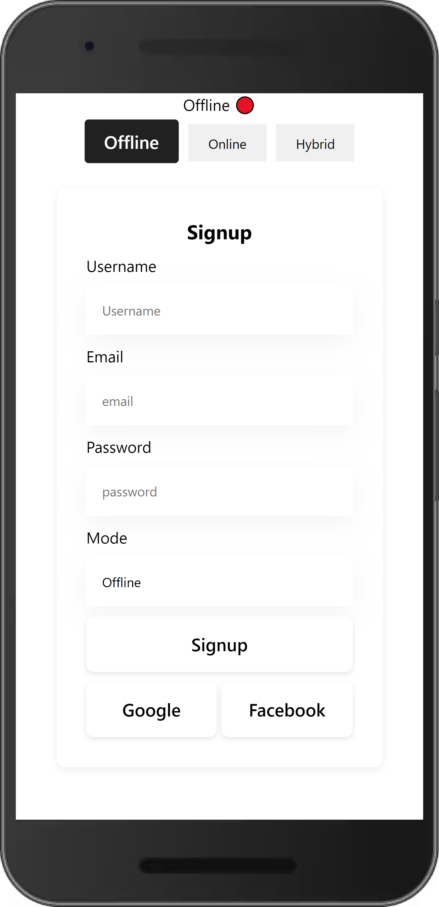
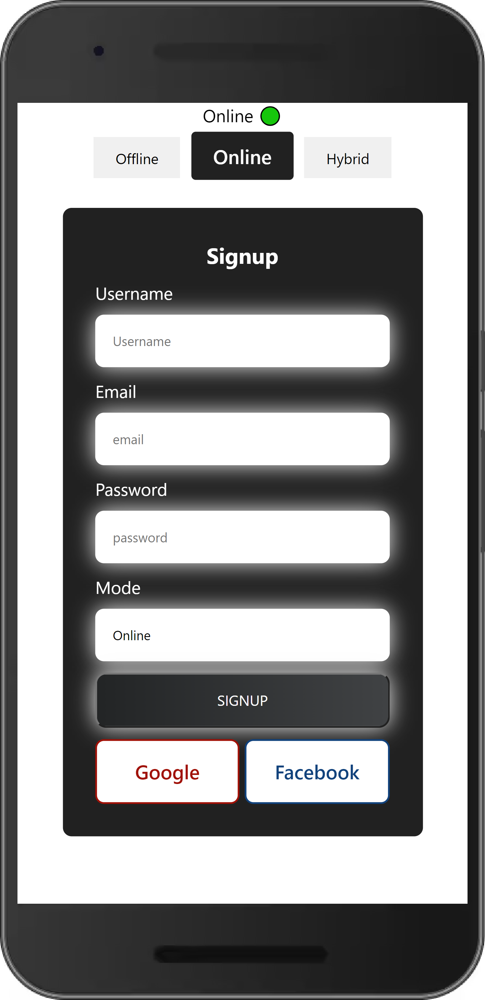
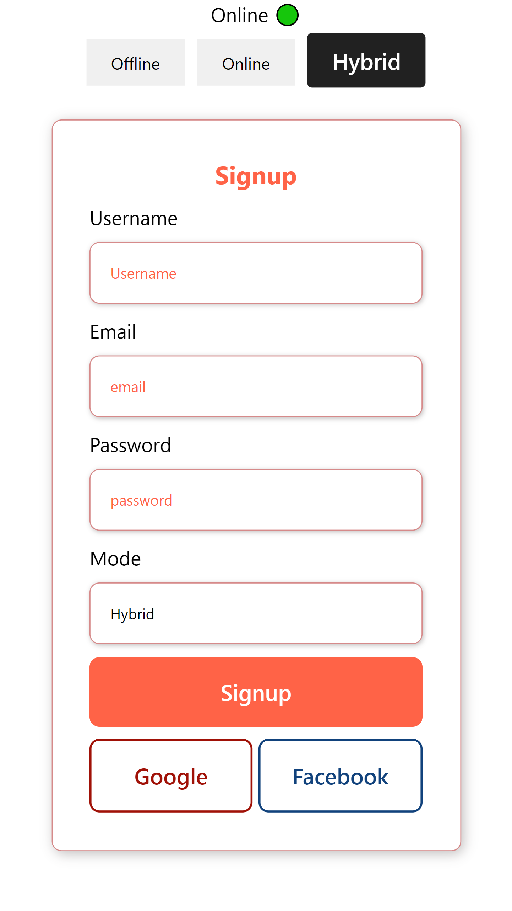

# Zarektronix_Assignment
Backend url :  https://zarektronix-1.onrender.com
video : https://drive.google.com/file/d/16dQNAg496ye1VQYsOgb75Qxt2a_FIW_8/view?usp=sharing
Welcome to the Zarektronix  assignment. 

## Table of Contents

- [About](#about)
- [Features](#features)
- [Getting Started](#getting-started)
- [Usage](#usage)
- [Technologies Used](#technologies-used)
- [Deployment](#deployment)
- [Contributing](#contributing)
- [License](#license)

## About

Zarektronix is a assignment for the user signup

## Features

- toast used for successfull
- Registration handle through backend

## Screenshots

## Deployment

Deployed Link:-https://zarektronix.vercel.app/

## Getting Started

# Clone the repository

git clone https://github.com/mohdadil12345/Zarektronix

# Change directory

cd your-repo

# Install dependencies

npm install

# Start the development server

npm start

## Technologies Used

- Zarektronix   is built using the following technologies:

- React.js
- css
- node
- express
- mongodb
- fetch
- vercel

## Usage

- Visit the application in your web browser at http://localhost:8080 or the URL https://zarektronix.vercel.app/.
